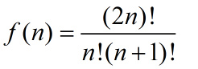

# 面试刷题总结
> 2018.09.08
## 前言
    最近笔试都没有好好准备，导致基本就是跪着，还是好好准备一下吧，每天准备认真的做一套面试题，把总结都写上。
## 正文
1.正则表达式 学 !important

2.typeof 
- 1: "number"
- '1': "string"
- true: "boolean"
- undefind: "undefind"
- function() {} : "function"
- new Number()、new String()、null、{ key: 1}、[]: "object"
- NaN :"number'
3.Object.prototype.toString.call()
- 1、new Number()、NaN: "[object Number]"
- '1'、new String(): "[object String]"
- true: "[object Boolean]"
- undefind: "[object Undefind]"
- function() {}: "[object Function]"
- {}: "[object Object]"
- null: "[object Null]"
- []: "[object Array]"
 
4.
ICMP  基于TCP/IP协议
DNS: UDP
E-mail:TCP/IP
FTP;文件传输 TCP/IP

5.一个URL包括以下几部分：协议名称、主机域名、包含页面内容的文件名

6.jquery ajax中都支持哪些数据类型? xml、html、json、jsonp

7.instanceof 判断数据类型，会根据其构造函数进行判断，所以通过原始值进行初始化的数据类型都不会判断成功

8.常见的浏览器端的存储技术： cookie、localStorage、sessionStorage、userData(ie专有，万恶的ie);

9.htlm中不常用的嵌套方式：  
- dl > dd、dt
- table > tr>th(头部)、td(内容)

10.rgba也是CSS3的新增属性

11.
```html
<a href="http://www.baidu.com" target="_Blank">百度</a>
```

- _Blank是新窗口

- _Self是自身

- _Parent是父窗口

- _Top是顶层窗口

12.image标签的属性alt和title同时设置的时候，alt作为图片的替代文字出现，title是图片的解释文字

13.inputElement.style.backgroundColor = 'red';

14.window.name来进行跨域

15.CSS sprites
- 允许你将一个页面涉及到的所有零星图片都包含到一张大图中去
- 利用CSS的“background-image”，“background-repeat”，“background-position”的组合进行背景定位

16.下列哪些对象有 length 属性
- window
- string
- function
- array

17. HTML5中可以用什么方法获取当前地址位置：getCurrentPosition()

18.操作系统的

 - 线程和进程的部分
   - 线程是进程的一个实体，可作为系统独立调度和分派的基本单位。
   - 一个进程中多个线程可以并发执行。
   - 线程可以通过相互之间协同来完成进程所要完成的任务。
   - 进程间的基本关系为同步与互斥
   - 并发性是指若干事件在同一时间内间隔内发生
   - 进程的特性包括：动态性，并发性以及异步性
   - 产生死锁的必要条件：互斥条件，请求与保持条件，不剥夺条件以及循环等待条件
 - 进程主要组成部分包括：PCB、数据、程序
 - 网络部分
   - 同一信道同一时刻通信的是全双工，半双工是是指在通信过程的任意时刻，信息既可由A传到B，又能由B传A，但只能 由一个方向上的传输存在。
19.二分查找方法 不能用于链表！

20.TCP的拥塞控制由4个核心算法组成：“慢启动”（Slow Start）、“拥塞避免”（Congestion voidance）、“快速重传 ”（Fast Retransmit）、“快速恢复”（Fast Recovery）

21.算法空间复杂度：程序使用的辅助空间

22.链表：头指针+尾指针：删除操作是o(1)，插入操作是o(n)。添加尾指针：提升了删除的效率，没提高插入的效率。

23.enctype属性的值由四个
- application/x-www-form-urlencoded：在发送前编码所有字符（表单默认）
- multipart/form-data：不对字符编码。在使用包含文件上传控件的表单时，必须使用该值。
- text/plain：空格转换为 "+" 加号，但不对特殊字符编码。
- application/json：json格式的数据

24.下面哪个算法对单链表排序最快? 快速排序

25.前缀表达式和后缀表达
a*(b-(c+d))的后缀表达式是abcd+-*，前缀表达式是*-+ 

26.栈一般可以用来实现递归

27.JavaScript库支持Promise规范 bluebird、co、Q(Q.js)

28.-8%2 = -0(0!==0)、-7%2 = -1;

29.DOM 操作中如何只判断两个节点是否有相同：element.isEqualNode();

30.使用冒泡排序为长度为50的数组升序排序，在最坏情况下，比较次数多少? 1225

31. 深度为5的满二叉树有2^k-1个叶子结点

32. ajax的缺点是对搜索引擎不友好，并且存在跨域问题限制

33.js里八进制是以零开始打头做声明的，如：020=2x8=16

34.设散列表长度为m，散列函数为H（key）=key%p，为了减少发生冲突的可能性，p应取小于m的最大素数

35.css 如何使用服务端的字体：@font-face

36.二叉树根据节点数计算有几种二叉树的格式：

37.归并的时候需要创建额外的内存空间

38.http和https用的端口不一样，前者是80，后者是443

39.关于触发进程调度的原因，下列说法正确的是：中断返回 、当前进程阻塞、当前进程的时间片用完

40.string.replace：只替换匹配到的第一个字符，string.replaceAll：替换所有匹配到的字符

41.关键字序列：（53,7,30,8,40,48,0,64,6,25,66,1）散列存储在一个哈希表中，若散列函数为H（key）=key%7，并采用链地址法来解决冲突，则在等概率情况下查找成功的平均查找长度为（）
链地址法
0下有7,0
1下有8,64,1
2下有30
3下有66
4下有53,25
5下有40
6下有48,6
ASL=（1*7+2*4+3*1）/12 = 18 / 12 = 1.5

42.
- text()设置或返回所选元素的文本内容；
- html（）设置或返回所选元素的内容（包括html标记）；
- val（）设置或返回表单字段的值；
- innerHTML/innerText:是原生js中的写法，jquery不支持。

43.当使用HTML5的拖放API实现拖动时，需要监听”开始拖动”事件，此事件的名称是：dragstart

44.
- fileStyle:设置填充颜色
- strokeStyle：设置边框颜色
- fillRect：画实心矩形
- strokeRect：画空心矩形

45.以下jQuery方法中那个方法可以设置渐变为给定的不透明度:$(selector).fadeTo()

46.先来看几个概念：
- 1.强占式：现行进程在运行过程中，如果有重要或紧迫的进程到达（其状态必须为就绪），则现运行进程将被迫放弃处理机 ，系统将处理机立刻分配给新到达的进程。
- 2. 静态优先权 ：在创建进程时确定的，优先权在进程的整个运行期间保持不变。
- 3. 动态优先权 ：在创建进程时所赋予的优先权，是可以随进程的推进或随其等待时间的增加而改变的，以便获得更好的调度性能，该优先权会随着等待的时间增长而增长。
然后在看选项：
- 1.非强占式静态优先权法 -- 优先权不会变，假如有一个最低优先权的线程在等待，那么等优先级高的进程执行完就可以轮到该进程执行了。
- 2.强占式静态优先权法 -- 强占式，说明高优先权的可以抢夺CPU的执行权。假如一个低优先权的执行，当一个高优先权的在就绪状态，那么CPU就会执行高优先权的那个进程，低优先权的就会处于等待，假如一直有高优先权的进程在就绪，那么就会一直等待。
- 3.时间片轮转调度算法 -- 执行的时间片完毕后，被执行的进程会放到等待队列的队尾，一次循环，既然是循环的话，那就有机会轮到。
- 4.非强占式动态优先权法 -- 虽然是非强占式的，但是如果一个进程一直在等待，那么他的优先权就会动态增长，就可以得到CPU的执行权。

47.指令一般由两部分组成：操作码：该指令完成操作的类型或性质、地址码：操作对象的地址

48.二叉树的节点和度的关系 关系：总度数=节点数-1

49.设有4 个作业同时到达，每个作业的执行时间均为2 个小时，它们在一台处理机上按单道方式运行，
则平均周转时间为（）。
为5小时. 
因为第一个作业无需等待,完成用2小时；第二个等待2小时,完成再用2小时,一共4个小时；第三个为6小时；第四个为8小时. 
所以(2+4+6+8)/4=5(小时)、

50.输入若已经是排好序的，下列排序算法最快的是（）插入排序

51.一个进程可以没有父进程或子进程

52.分组交换比电路交换,实时性差但线路利用率高

53.一棵满二叉树同时又是一棵平衡树
