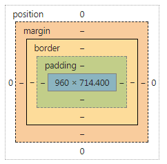

# css小结
>2018.10.05
## 前言
    MD以前写好了大部分的东西，电脑一死机GG，回到解放前，哎！好像哭啊！
## 正文
### 一、position和display
#### 1.position
- absolute：绝对定位，脱离文档流，基于其最近的非static定位的祖先元素进行定位
- relative：相对定位，未脱离文档流，具有自身正常位置进行定位
- static：默认值，没有定位，正常显示再文档流
- fixed：绝对定位，脱离文档流，局域浏览器窗口进行定位
- inherit  继承，继承父元素的positon属性值
#### 2.display
- block
  - 块级元素，默认占一行，宽度默认是父级元素宽度的100%
  - 可以设置width、height属性，设置了width也只占一行
  - 可以设置margin和padding属性
- inline
  - 行内元素，与其他inline和inline-block元素一起占一行，如果一行不够，则会换行（元素不会整体换行，会以内容换行）
  - 不可以设置width、height属性，默认宽高为内容宽高
  - 水平方向的margin和padding会生效，竖直方向不会失效
- inline-block
  - 行内块级元素，与其他inline和inline-block元素一起占一行，如果一行不够，则会换行（元素整体换行）
  - 可以设置width、height属性
  - 可以设置margin和padding属性
- flex：flex主要是进行flex布局中使用
- none：元素不会被显示
- inherit：继承，继承父元素的display属性值
- 还有一些奇葩的属性值，这里就不写了
### 二、关于盒模型
css元素都有一个盒模型来表示元素的组成，盒模型的由：content + padding +  border + margin注册
而盒模型一般分为两种：一是标准盒模型，其盒模型的宽高为content的宽高；二是IE盒模型，其宽高为content+padding+border和的宽高
可以通过设置box-sizing来转换盒模型的标准
```css
/* 标准模型 */
box-sizing:content-box;
 /*IE模型*/
box-sizing:border-box;
```
<div style='text-align: center'>

<div>

### 三、flex布局
### 四、关于float
### 五、关于几个经典的布局
### 六、em和rem
在css中px是固定像素，而em和rem是相对像素，其中em是先对父元素的字体大小进行计算的，而rem是先对与根元素的字体大小进行计算的，根元素就是html
### 七、居中的几种方法
### 八、重构和回流
### 九、渐进增强和优雅降级
### 十、
## 参考